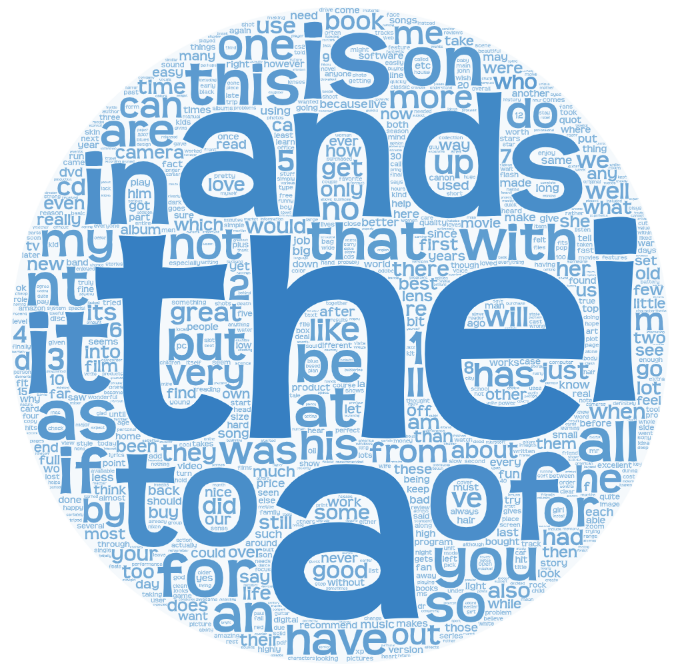

# Customer Review Classification

This repository contains the implementation of Naive Bayes algorithm to classify customer reviews from the words in the review. My classification method can be adapted to any text label. However, I mainly focus on positive/negative and topic classification tasks.

## Dataset

In this project, Blitzer customer reviews dataset is used. It contains 11,914 tokenized and normalized reviews. 80% of this data is used as train set and 20% of it is used as test set. This dataset also provides topic category label, sentiment category label and document identifier. In this project, I consider sentiment category label (positive, negative) and topic category label (books, camera, dvd, health, music, software). Below is the table of review numbers for train and validation sets.

| Type of Review | # Reviews |
| :- | -: |
| Positive | 6000 |
| Negative | 5914 |

Word clouds are great way to represent words in a corpus. By looking the fonts of the words, we can understand the frequencies of the words in the corpus. Even more, we can understand the content of the corpus. Below are the word cloud representations of the positive and negative reviews.

### With Stop Words

There are stop words in the corpus. Below are the word clouds of positive and negative reviews with no data pre-processing. As it can be seen from these representations, stop words occur the most in both positive and negative reviews. Therefore it gets harder to keep track of specific keywords that may be useful.

Positive | Negative
:-------------------------:|:-------------------------:
 | 

Below is the table of 3 most frequent words and their statistics in positive reviews with no data pre-processing.

| Words | # Pos Occ |
| :- | -: |
| the | 41335 |
| and | 23059 |
| a | 19932 |

Below is the table of 3 most frequent words and their statistics in negative reviews with no data pre-processing.

| Words | # Neg Occ |
| :- | -: |
| the | 40685 |
| i | 21218 |
| to | 21049 |

As above word clouds and tables show, top 3 words do not help us to find specific words of the review types with no data pre-processing.

### Without Stop Words

Below are the word clouds of positive and negative reviews with stop words removal. *from sklearn.feature extraction.text import ENGLISH STOP WORDS* import is used to remove stop words. Although we clean the common words, there are still some common words like "s" and "nt". These words are not in imported words. That is why they are not removed. On the other hand, some specific words start to appear according to review types.

Positive | Negative
:-------------------------:|:-------------------------:
 | 

Below is the table of 3 most frequent words and their statistics in positive reviews with stop words removal.

| Words | # Pos Occ |
| :- | -: |
| s | 6537 |
| nt | 3561 |
| great | 2492 |

Below is the table of 3 most frequent words and their statistics in negative reviews with stop words removal.

| Words | # Neg Occ |
| :- | -: |
| s | 6209 |
| nt | 5330 |
| like | 2778 |

As above word clouds and tables show, top 3 words are better specific words than top 3 words with no data pre-processing. However they are still unhelpful words.

| Words | # Pos Occ | # Neg Occ |
| :- | -: | -: |
| great | 2492 | 1060 |
| best | 1278 | 562 |
| bad | 313 | 902 |

While observing the words with the highest frequency, 3 words given in the table above are useful to distinguish positive and negative reviews well.

## Naive Bayes Classifier

To perform customer review classification, Naive Bayes and Bag of Words (BoW) approaches are used. BoW learns a vocabulary from the corpus and models the corpus by counting the occurrences of words. Two types of features are used for these approaches: unigram where occurrences of each word are considered and bigram where occurences of two adjacent words are considered.

I firstly load data, adjust labels for categories and split it into train and test data. Then I create my Naive Bayes classifier object. I implement my own BoW representation. After obtaining the classifier object, I follow the below steps for training. Note that Naive Bayes classifier gives probabilities between 0 and 1. By using logarithms, we can obtain better representative numbers from a wider range, instead of tiny probabilities. So log probabilities are used to prevent numerical underflow.

1. **Create BoW Dictionary**: I create an empty BoW dictionary which stores labels as key and label dictionaries as values. In those label dictionaries, keys are words belonging to that class and their occurrences as their values. For each review in the train set, I split them to obtain words. If specified, I discard punctuations and stop words. According to specified feature, I calculate ngram. Ngram is one word in unigram, two adjacent words in bigram. Then I check whether this ngram is in BoW for its label. If it is not, I add it by giving its value as 1 and if it is I increase its value. I also keep the unique words of the corpus in a set.

2. **Calculate Log Prior Probability**: For each class, I calculate the log prior probability by taking the logarithm of the result of the number of reviews belonging to that class divided by the number of total reviews and store them in a dictionary.

3. **Calculate Log Likelihood Probability**: For each word in each class, I calculate the log likelihood probability by taking logarithm of the result of the occurrences of current word in current class divided by sum of the occurrences of the words belonging to the current class. I store those log likelihoods in a dictionary.

We can encounter words in testing that we did not encounter in training. To handle this situation, we need to perform Laplace smoothing so that we do not assign 0 probability to unseen word which would be wrong. To do so, I add 1 as an alpha value to numerator part and the length of vocabulary of the corpus to denominator part.

After training, I follow the below steps for testing.

1. **Create Votes Dictionary**: I create an empty dictionary where keys are the classes and values are the votes for those classes. The values are assigned 0 at first.

2. **Initialize Class Vote**: For each class, I initialize the votes for current class with log prior probability of current class.

3. **Sum Log Likelihood Probabilities with Vote**: For each word in given test sample, I get the log likelihood probability of current word and add it to the vote. Note that I perform addition because I work with logarithm values.

4. **Predict with Maximum Vote**: After obtaining votes of each class for given test sample, I find the maximum vote and return the corresponding class.

## Positive/Negative Classification Experimental Results

Below tables are test accuracies of Naive Bayes classifier using unigram and bigram features. The vanilla models are the models that no data pre-processing is done. They are indeed the best ones. I also test the model by removing punctuations, stop words, and both punctuations and stop words. The decrease in accuracy shows that they are helpful in the model. For instance, removing stop words has a direct effect on bigram. Because it interferes two adjacent words and this effects the probabilities directly. I also used TF-IDF scores, too. The performance of bigram feature is better than unigram feature. Usually, bigram is better than unigram. Because it stores more general information than just individual words. By considering two adjacent words, it considers more accurate tokens to make predictions. Therefore bigram feature is my choice in sentiment category classification.

**Unigram**

| Model | Accuracy |
| :- | -: |
| Vanilla | **81.70** |
| w/o Punct | 81.62 |
| w/o SW | 81.33 |
| w/o Punct & SW | 81.16 |
| w/ TF-IDF | 60.54 |

**Bigram**

| Model | Accuracy |
| :- | -: |
| Vanilla | **86.57** |
| w/o Punct | 86.15 |
| w/o SW | 82.38 |
| w/o Punct & SW | 81.24 |
| w/ TF-IDF | 61.02 |

Below is the confusion matrix of the best model obtained **86.57** test accuracy:

## Topic Classification Experimental Results

I also implemented a classifier that predicts the topic category label instead of sentiment category label. My implementation can be adapted to any text category label classification problem. Below are the test accuracies I obtained from several models.

**Unigram**

| Model | Accuracy |
| :- | -: |
| Vanilla | 91.57 |
| w/o Punct | **91.78** |
| w/o SW | 87.37 |
| w/o Punct & SW | 87.16 |
| w/ TF-IDF | 62.33 |

**Bigram**

| Model | Accuracy |
| :- | -: |
| Vanilla | 88.12 |
| w/o Punct | **88.80** |
| w/o SW | 84.26 |
| w/o Punct & SW | 80.86 |
| w/ TF-IDF | 61.01 |

Below is the confusion matrix of the best model obtained **91.78** test accuracy:

